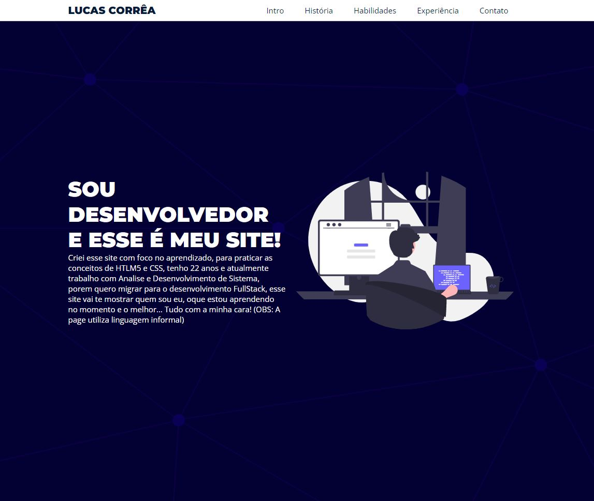

OBS: Esse é meu primeiro README, perdão pelo amadorismo haha!

# Landing Page CSS Puro

Este é uma Landing Page simples, feita apenas com CSS, ela tem como objetivo maior o aprendizado.

# Caracteristicas da Landing Page

Esta Landing Page como é focada em aprendizado, ela é bem simples, porem todo código por mais simples que seja tem que funcionar!
A pagina é totalmente responsiva e possui algumas MediaQueries, para que funcione tambem em Mobile.
Essa page está com Menu Adaptado para Mobile que tambem foi feito em CSS.

Técnologias utilizadas: HTML5 e CSS.

Objetivo: Aprendizado

# Autor

Me chamo Lucas Corrêa, tenho 22 anos, e moro no Rio Grande do Sul e atualmente sou estudante de programação.

OBRIGADO!
